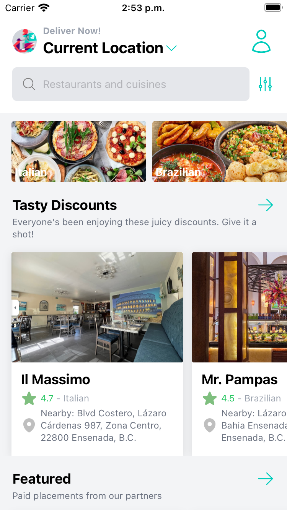
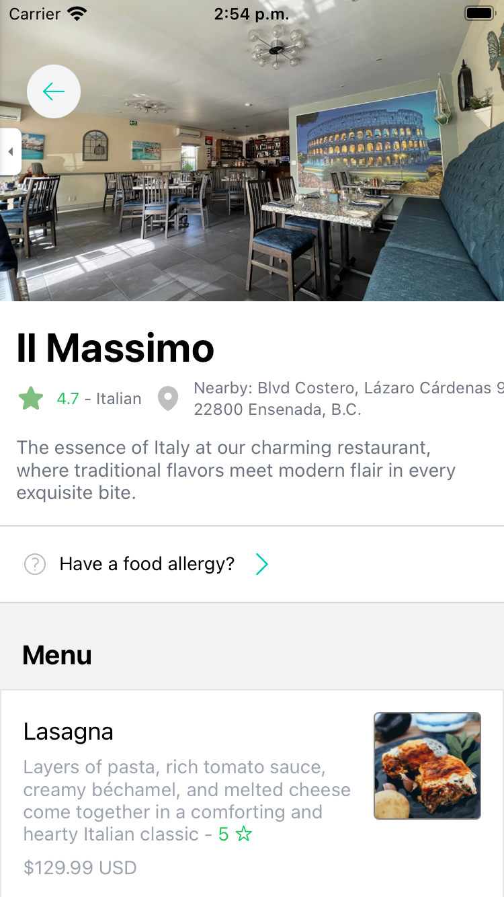
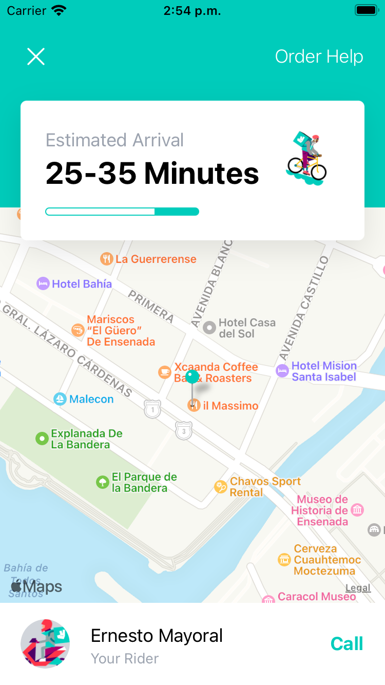

# deliver-app

**Description**

Mobile app developed with Expo and React Native that allows you to order food, just like Uber Eats.

**Screenshots**

    
    
    

**Prerequisites**

Be sure that you have already installed:
- NodeJs version 20.2.0.
- Expo.
- Git.
- Expo Go app in a smartphone or an emulator.

**Instructions**

- run in your git console `git clone https://github.com/fimbres/deliver-app.git`
- run `cd deliver-app`
- run  `npm install` or just `npm i`
- Open the project with your IDE.
- run `npm run start` or `expo start`
- scan the QR code using your smartphone. (this should open your Expo Go app with the `deliver-app` running on your smartphone)
